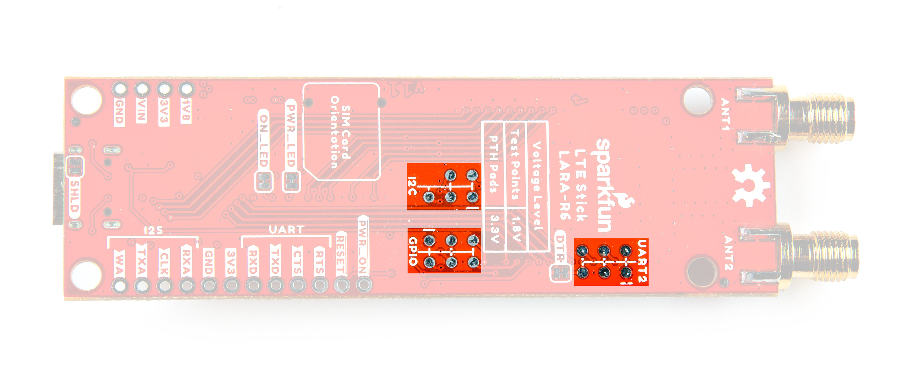
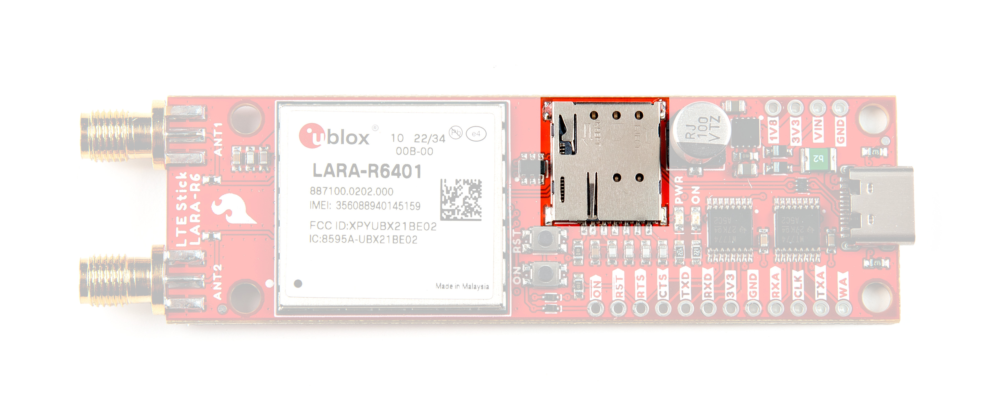
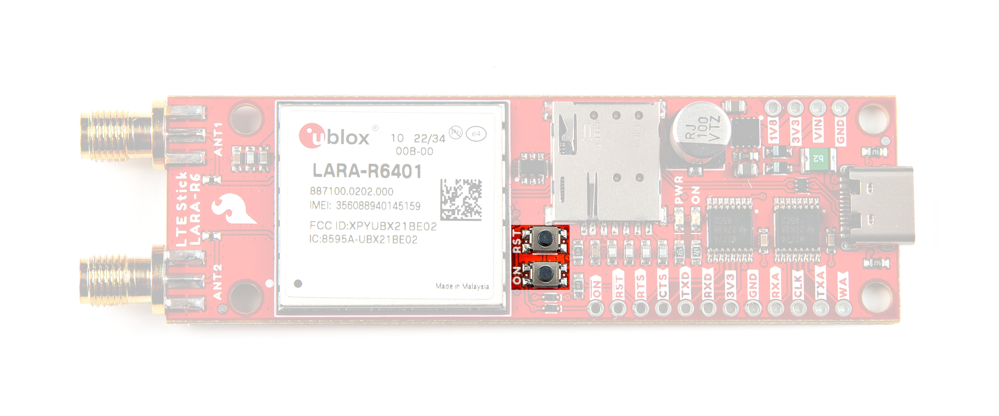
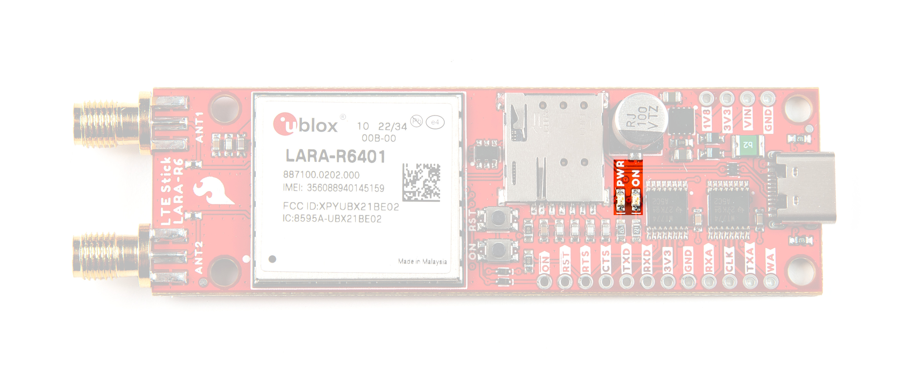

## LARA-R6 LTE Module

The heart of the LTE Stick is the LARA-R6 LTE Cat 1 module from u-blox. The LARA-R6401 supports data, SMS, <i>and</i> voice over LTE bands and works with most major North American carriers (Verizon, TMobile, AT&T, etc.). 

<figure markdown>
[{  width="400"}](./assets/img/LTE_Stick-LARA-R6.jpg "Click to enlarge")
</figure>

The LARA-R6 has the following interfaces: USB, 2x UART, I2S, I2C, SIM interface, and nine GPIO pins. It also has a host of features including device security through Root of Trust (RoT) with secure boot and update, firmware updates both over the air (uFOTA) and through AT commands, dynamic antenna tuning, jamming detection, and much more. For a complete overview of these features and other information on the LARA-R6401, refer to the [datasheet](./assets/component_documentation/LARA-R6-Datasheet.pdf). The R6401 supports LTE FDD bands from 600 MHz to 1900 MHz (2, 4, 5, 12, 13, 14, 66, and 71).

## Pinout

The board breaks out the LARA-R6's UART and I2S interfaces as well as the Power On, Reset and voltage pins to a pair of 0.1"-spaced PTH (plated through-hole) headers.

<figure markdown>
[{  width="400"}](./assets/img/LTE_Stick-PTHs.jpg "Click to enlarge")
</figure>

The list below outlines the functionality of pins broken out on the LTE Stick:

  * PWR_On - LARA-R6 power control pin
  * Reset - LARA-R6 reset pin
  * RXD - UART data out
  * TXD - UART data in
  * CTS - UART clear to send
  * RTS - UART ready to send
  * RXA - I2S receive data
  * CLK - I2S clock
  * TXA - I2S transmit data
  * WA - I2S word alignment

  * VIN - 5V 
  * 3.3V - Regulated 3.3V
  * 1.8 - Regulated 1.8V  
 
### Test Points

!!! warning
	All three of these clusters have test point connections for <b>1.8V</b> and <b>GND</b> and connect directly to the associated pins on the LARA-R6. These pins are <i>not</i> level-shifted and run at <b>1.8V</b> logic. Take care when interacting with these pins to avoid damaging the signals they connect to.

The LTE Stick also has several other interfaces broken out to test points for advanced users to solder to. These test points are small copper pads grouped into three clusters labeled: <b>I2C</b>, <b>GPIO</b>, and <b>UART2</b>. They do not have individual pin labels so refer to the [board files (ZIP)](./assets/board_files/SparkFun_LTE_Stick_LARA_R6.zip) to identify the pin locations.

<figure markdown>
[{  width="400"}](./assets/img/LTE_Stick-Test_Points.jpg "Click to enlarge")
</figure>

The I2C cluster contains the LARA's I2C bus pins (SDA/SCL) as well as GPIO4. The GPIO cluster contains GPIO1, GPIO2, GPIO3, and GPIO6. All GPIO pins can act as a generic GPIO signal but some have alternate functions outlined in section 2.8 of the [LARA-R6 datasheet](./assets/component_documentation/LARA-R6-Datasheet.pdf). 

The UART2 cluster contains the LARA's UART2 pins: TX2, RX2, CTS2, and RTS2. This interface is disabled by default and can be activated by the dedicated AT command. Refer to section 18.12 of the [AT commands manual](./assets/component_documentation/LARA-R6-L6-AT-Commands.pdf) and section 1.9.1.2 of the [integration manual](./assets/component_documentation/LARA-R6-L6-Integration-Manual.pdf) for complete information on using these pins. Users also should open the <b>DTR</b> solder jumper to use this pin for TX2 (refer to the Solder Jumpers section for more information on the DTR jumper).

## Connectors/Connections

Let's take a closer look at the connectors on the LTE Stick.

### Power

The LTE Stick uses a USB-C connector for primary power input and serial communication. The board also has dedicated PTHs for the three voltage inputs on the board: <b>5V(VIN)</b>, <b>3.3V</b>, and <b>1.8V</b> along with PTHs for Ground.

<figure markdown>
[{  width="400"}](./assets/img/LTE_Stick-Power.jpg "Click to enlarge")
</figure>

### Antenna Connections

The LARA-R6 has two antenna connections; Primary (ANT1) and Secondary (ANT2). The Primary antenna functions as the main antenna interface and supports TX/RX transmissions. The Secondary antenna communicates over RX only for the LTE / 3G RX diversity configuration. 

<figure markdown>
[{  width="400"}](./assets/img/LTE_Stick-SMA.jpg "Click to enlarge")
</figure>

### Nano SIM Card Slot

The LTE Stick has an on-board Nano SIM card slot. The LTE Stick uses the LARA-R6401 which works with most major North American carriers (Verizon, TMobile, AT&T, etc.).   

<figure markdown>
[{  width="400"}](./assets/img/LTE_Stick-SIM.jpg "Click to enlarge")
</figure>

## Buttons

The board has two buttons labeled <b>ON</b> and <b>RST</b>. The <b>ON</b> button connects to the LARA-R6 PWR_On pin which turns the module on and off. Tap it once to turn the module on and hold it down for three seconds to turn it off. The <b>RST</b> button connects to the LARA-R6's reset line and resets the module when pressed.

<figure markdown>
[{  width="400"}](./assets/img/LTE_Stick-Buttons.jpg "Click to enlarge")
</figure>

## LEDs

The LTE Stick has a pair of red LEDs labeled <b>PWR</b> and <b>ON</b>. The <b>PWR</b> LED indicates whenever the 3.3V rail is powered through USB or the VIN/3.3V PTH pins. The <b>ON</b> LED indicates when the LARA-R6 is powered up. 

<figure markdown>
[{  width="400"}](./assets/img/LTE_Stick-LEDs.jpg "Click to enlarge")
</figure>

## Solder Jumpers

??? note "Never modified a jumper before?"
	Check out our <a href="https://learn.sparkfun.com/tutorials/664">Jumper Pads and PCB Traces tutorial</a> for a quick introduction!
	

		<a href="https://learn.sparkfun.com/tutorials/664">
		 
        How to Work with Jumper Pads and PCB Traces</a>
	

The LTE Stick has four solder jumpers labeled <b>PWR_LED</b>, <b>ON_LED</b>, <b>SHLD</b>, and <b>DTR</b>. 

<figure markdown>
[{  width="400"}](./assets/img/LTE_Stick-Jumpers.jpg "Click to enlarge")
</figure>

The <b>PWR_LED</b> and <b>ON_LED</b> jumpers complete the power circuits for their associated LEDs (PWR and ON). They are CLOSED by default. Open them to disable these LEDs to help conserve power. The <b>SHLD</b> jumper connects the USB-C connector's shield pin to ground. Open it to isolate the shield pin. The <b>DTR</b> jumper is CLOSED by default and pulls the LARA-R6 DTR pin to ground (LOW) to function as UART data terminal ready. Open the jumper to use the DTR pin for its secondary use as TX2 when using the UART2 test point cluster.

## Board Dimensions

The board measures 3.25" x 1.00" (82.55mm x 25.40mm) with four mounting holes that fit a [4-40 screw](https://www.sparkfun.com/products/10453).

<figure markdown>
[{ width="600" }](./assets/board_files/SparkFun_LTE_Stick_LARA_R6-Dimensions.png "Click to enlarge")
<figcaption markdown>
[Board dimensions](./assets/board_files/SparkFun_LTE_Stick_LARA_R6-Dimensions.png) for the SparkFun LTE Stick, in inches.
</figcaption>
</figure>

??? tip "Need more measurements?"
	For more information about the board's dimensions, users can download the [Eagle files](../assets/board_files/eagle_files.zip) for the board. These files can be opened in Eagle and additional measurements can be made with the dimensions tool.

	??? info ":octicons-download-16:{ .heart } Eagle - Free Download!"
		Eagle is a [CAD]("computer-aided design") program for electronics that is free to use for hobbyists and students. However, it does require an account registration to utilize the software.

		

		[Download from :autodesk-primary:{ .autodesk }](https://www.autodesk.com/products/eagle/free-download "Go to downloads page"){ .md-button .md-button--primary width="250px" }
		

	
	??? info ":straight_ruler: Dimensions Tool"
		This video from Autodesk demonstrates how to utilize the dimensions tool in Eagle, to include additional measurements:

		

		

		<iframe src="https://www.youtube.com/embed/dZLNd1FtNB8" title="EAGLE Dimension Tool" frameborder="0" allow="accelerometer; autoplay; clipboard-write; encrypted-media; gyroscope; picture-in-picture" allowfullscreen></iframe>
		

		
