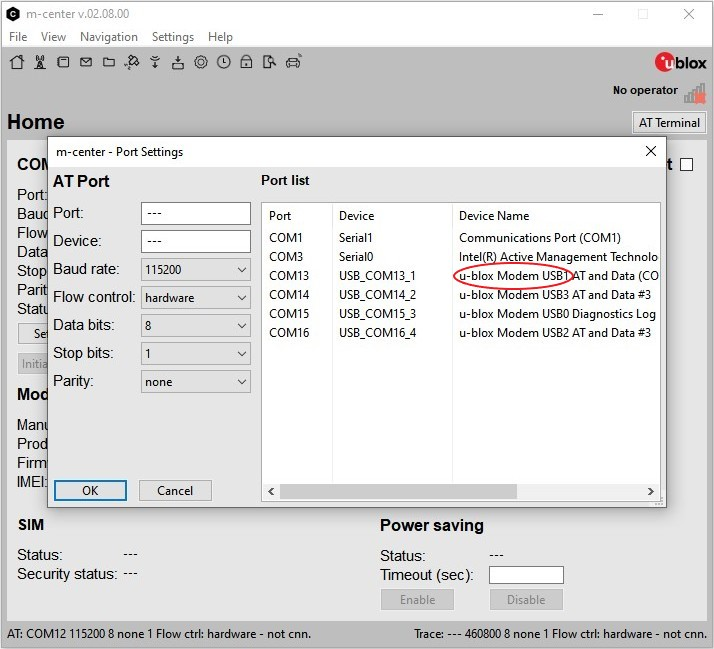

The m-center application from u-blox is an excellent configuration and interaction tool for the LARA-R6 (and other cellular modules). It is only available on Windows so if you have a different operating system, you'll need to use another software solution like the SparkFun u-blox AT Command Arduino Library covered in the next sections. This section goes over how to install the software and some basics of using it with the LTE Stick to make sure the board is working.

## Download m-center

The m-center application is available from u-blox [here](https://www.u-blox.com/en/product/m-center). Click the button on that page to download the installer. Locate that file and follow the instructions to finish the installation process.

**Screenshot needed? - ML**

This section only covers a few of the basics to get started using the LTE Stick with m-center. Refer to u-blox's [m-center User Guide](https://www.u-blox.com/en/m-center-user-guide) for a complete overview of all of the application's features.

### Download Windows Drivers

The LARA-R6 also requires a Windows USB driver download. Find it on u-blox's [LARA-R6 Documentation & Resources](https://www.u-blox.com/en/product/lara-r6-series?legacy=Current#Documentation-&-resources) page or download the driver ZIP directly by clicking the button below:

[u-blox LARA-R6 Windows Driver (ZIP)](https://content.u-blox.com/sites/default/files/2023-10/ublox_R4_R6_L6_windows_3264_v2.0.0.0.zip){ .md-button .md-button--primary }

Open the file once it downloads and follow the instructions to complete the driver installation.

## Basic LTE Stick Connection & Testing

Now that everything is downloaded connect the LTE Stick over USB and press the "On" button to power up the LARA-R6, open m-center and you'll see this menu:

<figure markdown>
[{ width="600" }](./assets/img/m-center_no_device.jpg "Click to enlarge")
</figure>

Next, click the "Set Port" button to select the COM port the LTE Stick is on. The LTE Stick has four port options in this menu as the screenshot below shows. Select the one for USB1 (labeled "u-blox Modem USB1 AT and Data (COM#) or similar) and click "Connect". If you do not see any devices available or see unrelated ports, make sure the "ON" LED is illuminated on the LTE Stick and that the drivers finished installing.

<figure markdown>
[{ width="600" }](./assets/img/m-center_port_menu.jpg "Click to enlarge")
</figure>

After the board connects, m-center will display the LARA-R6's modem information including manufacturer, device ID, and firmware version. It also opens the terminal interface and prints out the device's response to the Generic set of AT commands similar to the screenshot below:

<figure markdown>
[{ width="600" }](./assets/img/m-center_terminal.jpg "Click to enlarge")
</figure>

This basic printout lets you know most things are working but the main m-center menu also has several tabs at the top for testing other things such as network connection, firmware update (FOTA or AT command), SMS messages, and more. You can also click the "Initialization" button to initialize the LARA-R6 again or the "Get info" button to refresh the modem information and SIM status.

## Network & Operator Setup

Now that we have the LTE Stick connected and reporting the correct device information, it's time to connect to the cellular network and select the operator. Click the "Cell Tower" image in the top left to switch to the Network tab. In this tab, we can get the network information and operators list as well as the PSD (packet-switched-data profiles) though the PSD profiles are not necessary for basic use of the LARA-R6.

<figure markdown>
[{ width="600" }](./assets/img/m-center_network_tab.jpg "Click to enlarge")
</figure>

Click the "Get List" button to have the LARA-R6 report all available network operators for the connected SIM card. If no operators are selected, choose an available/preferred operator and you're all set to move on to using the LTE Stick on your cellular network. 

<figure markdown>
[{ width="600" }](./assets/img/m-center_network_operator.jpg "Click to enlarge")
</figure>

That covers the basics of getting started with m-center. For more information, check out u-blox's [m-center user guide](https://www.u-blox.com/en/m-center-user-guide) or read on to the next section to learn how to use the LTE Stick with Arduino and the SparkFun u-blox Cellular Arduino Library.